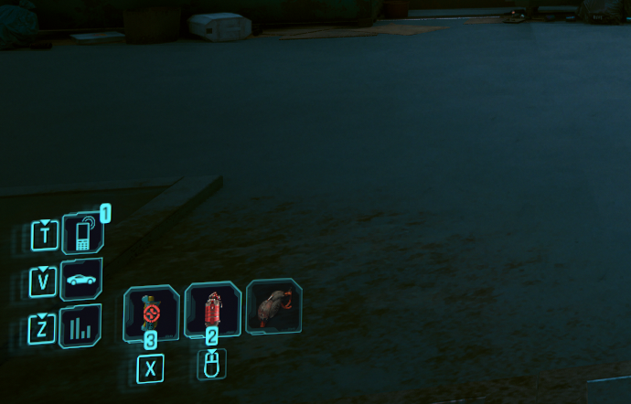

# Update HUD - VERY SIMPLE MOD FOR STUDY

This mod update cellphone hud, for study.

before



After


## How use?

1. Install mod [https://www.nexusmods.com/cyberpunk2077/mods/5266](https://www.nexusmods.com/cyberpunk2077/mods/5266)
2. Extract file `Update Hud Icon.zip` in your game folder, example, my game folder is:

```D:\Cyberpunk2077\REDprelauncher.exe```

then, I extract file `.archive` inside

```D:\Cyberpunk2077\archive\pc\mod\Update Hud Icon.archive```

## How remove?

remove ONLY `Update Hud Icon.archive` inside `\archive\pc\mod\`

> test